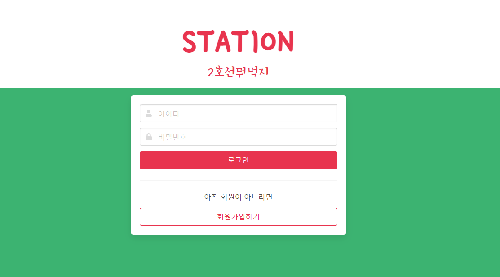
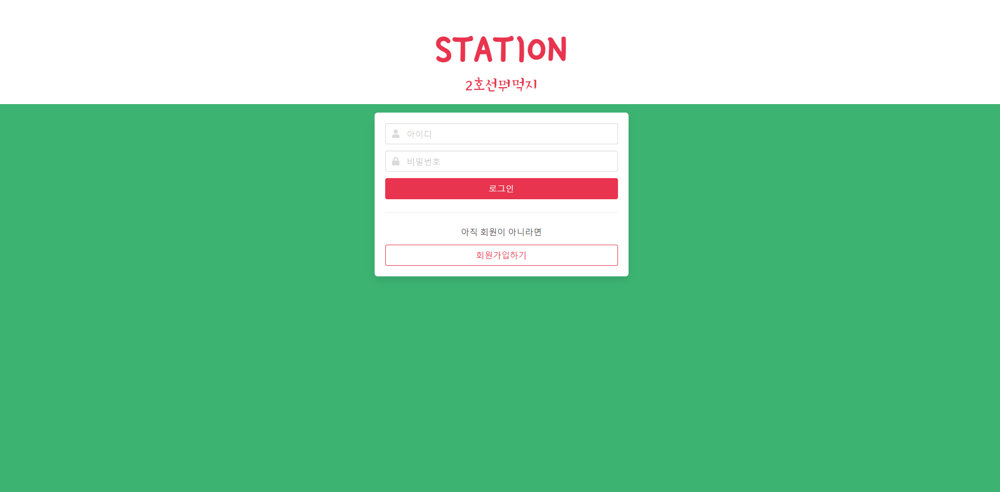
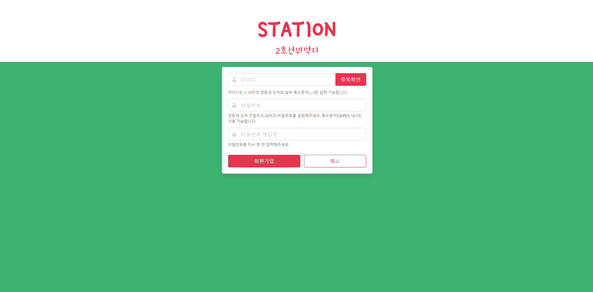
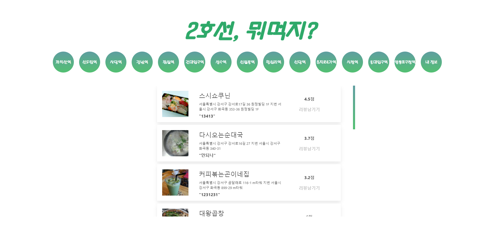
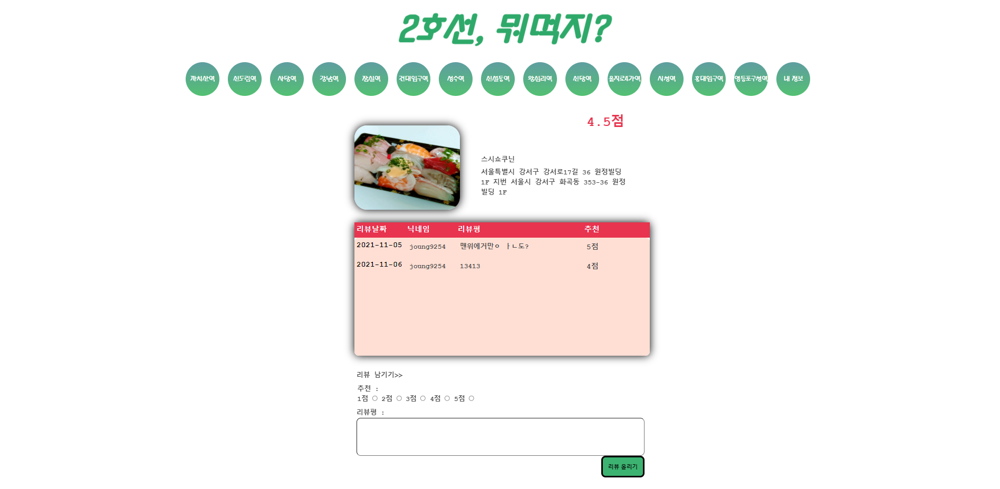
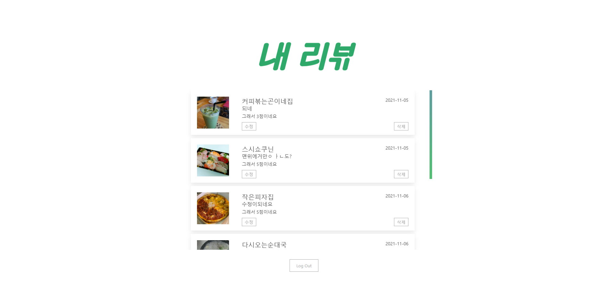

# 🍽 17조 프로젝트 '2호선, 뭐먹지?' 
웹사이트 주소 : http://jeongyeon9254.shop/login

### 매일같이 타는 2호선.. 근처에 무슨 맛집이 있을까 고민하셨다구요??
### 2호선 뭐 먹지에서 근처에 있는 맛집을 알아보고 나의 리뷰와 평점을 남겨보세요
### 다양한사람들의 리뷰와 평점을 공유할 수 있습니다.

 

## 👥 17조 MEMBER

##### 👨‍💻정상일 https://github.com/jsni94
##### 👨‍💻정연재 https://github.com/jeongyeon9254
##### 👩‍💻안지윤 https://github.com/Jdoubleeyun
##### 👨‍💻유희준 https://github.com/UHeeJoon

 

## 🔍 주요페이지별 기능

1. 로그인페이지
   1. 회원가입을 할 경우 정보를 DB에 저장합니다
   2. 사용자가 적은 정보를 DB에 대조하여 확인한후 토큰을 발행하여 로그인합니다.

2. 리스트 페이지
   1. 해당 역 데이터를 가지고 있는 식당목록을 리스트업합니다.
   2. 각 식당이 가지고있는 최신의 리뷰와 평균평점을 업데이트합니다.

3. 리뷰작성 페이지 
   1. 해당역의 정보를 볼수있으며 리뷰와 평점을 남길수 있습니다.
   2. 각 사용자가 남긴 리뷰와 평점을 보여줍니다

4. 마이페이지
   1. 내 리뷰를 모아서 볼수 있으며 수정과 삭제가 가능합니다.

 

## 📁 주요 API 리스트

기능|URL|METHOD|REQUEST|RESPONSE
---|---|---|---|---|
메인페이지 렌더링|/| | |login.html|
로그인|/sign_in|post|username,password|json|
회원가입|/sign_up/save|post|username,password|json|
아이디 중복확인|/sign_up/check_dup|post|username|json|
선택화면 렌더링|/line|get|stations|line_choice.html|
홈 클릭시 모든 식당렌더링|/shop|get|shop,title.stations|line_base.html|
역 클릭시 해당역 식당렌더링|/shop/keyword2|get|shop,title.stations|line_base.html|
식당 리뷰페이지|/review/keyword|get|shop,title.stations, pic,wrd,userinfo|review.html|
리뷰작성|/api/review_create|post|user,img,date,shop,score,review|json|
마이페이지|/my/reviews|get|review,user|MYreview.html|
리뷰삭제|/my/review/modify|post|reviewname,reviewdesc|json|
리뷰삭제|/my/review/delete|post|reviewname,reviewdesc|json|

 

## ⚙ 기술스택 및 프레임워크

* 프론트엔드
  * html
  * css (bulma framework)
  * javscript (jQuery)
 
 
* 백엔드
  * python (flask)

 

## 💡 문제점과 문제해결방법

* 문제점 : jinja2로 한db에서 리스트를 가져와 for문을 돌리는데 다른db에서 같은 이름일 경우에만 출력되게 하는 방식이 필요했습니다.
  * 해결방법 : for문안에 다른 db를 가져와 다시 포문을 돌리고 각 db에 이름을 뽑아와 선언해준뒤 if문을 써서 각 이름이 맞다면 출력하는 방식으로 만들었습니다.
  

* 문제점 : 리뷰작성시 리뷰db에만 평점이 저장되는데 이 점수를 총합산해서 평균낸 점수로 다시 레스토랑db에 넣어야 했고 그것을 리스트로 출력해야했습니다.
  * 해결방법 : 리뷰데이터에 저장된 총점을 모아 리스트로 만들고 그값을 숫자형 데이터로 변환하여 더했습니다. 더한값을 리뷰의 len값으로 나눈뒤 다시 그값을 레스토랑db like에 저장했습니다.

* 문제점 : 제대로 종료되지 않은 포트가 다른 서버를 시행했을 떄 오류가 발생했습니다.
  * 해결방법 : 포트를 강제종료_ cmd 창에서 (netstat -ano | find "종료하려는 포트번호") > (pid주소 확인) > (taskkill /F /PID (PID 번호)) 으로 해결했습니다

* 문제점 : 리뷰를 작성하는 유저가 직접 닉네임을 작성하지 않아도 리뷰조회시 표시한다면?
  * 해결방법 : 회원가입시 저장되는 paylod된 토큰에서 사용자의 id인 닉네임을 받아 render_template시 같이 보내준다

 

## 🚩 미니프로젝트 결과물

- 로그인페이지
 
 
 

- 회원가입페이지
 
 
 

- 메인페이지
 
 
 

- 리뷰작성페이지
 
 
 

- 리뷰수정페이지
 