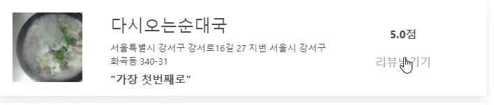
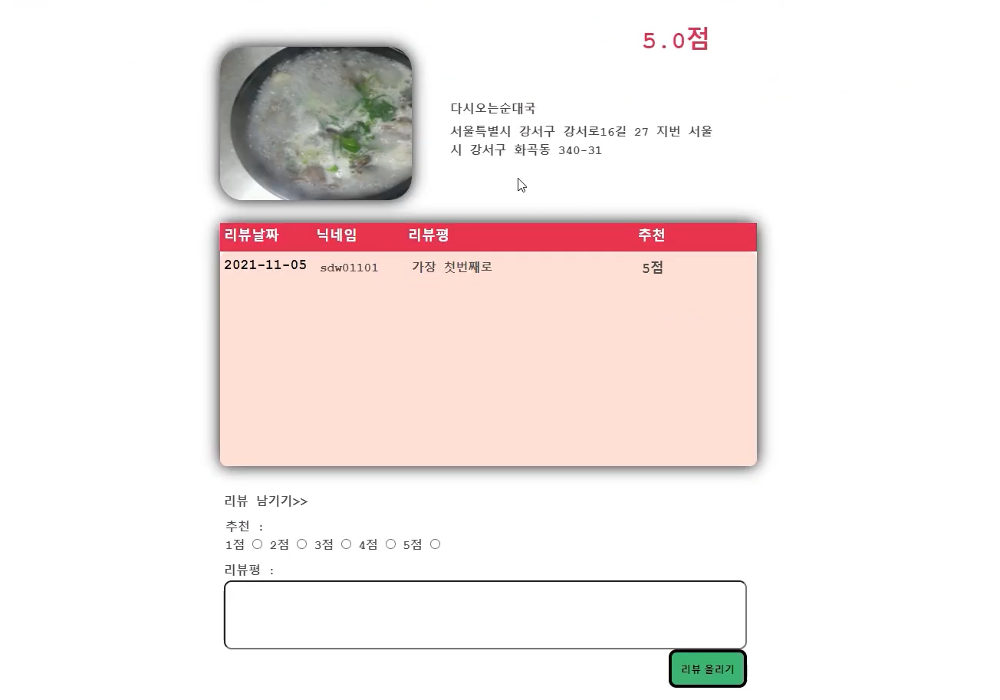
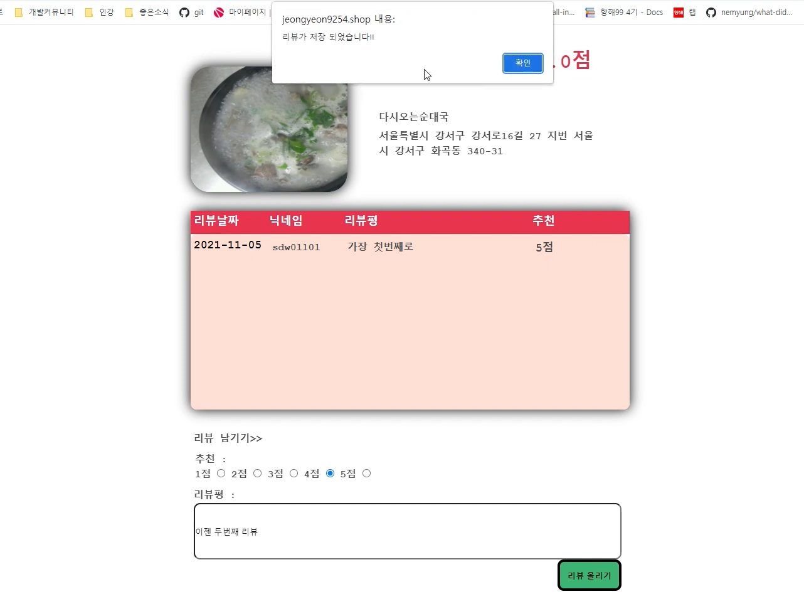
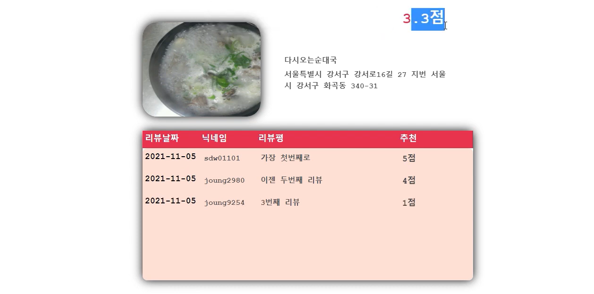

17조 프로젝트 '2호선, 뭐먹지?' 입니다.

http://jeongyeon9254.shop/login

[review작성 페이지]  
문제해결  
>1 :  
제대로 종료되지 않은 포트가 다른 서버를 시행했을 떄 오류가 발생한다면?   
포트를 강제종료_ cmd 창에서 (netstat -ano | find "종료하려는 포트번호") > (pid주소 확인) > (taskkill /F /PID (PID 번호))    
2:   
리뷰를 작성하는 유저가 직접 닉네임을 작성하지 않아도 리뷰조회시 표시한다면?  
회원가입시 저장되는 paylod된 토큰에서 사용자의 id인 닉네임을 받아 render_template시 같이 보내준다.

질문사항
>

구현설명

>
> "자세히보기" 버튼을 눌러 가게정보와 리뷰를 조회합니다.

>
>해당 가게의 정보(이미지, 이름, 설명, 추천 점수)와 리뷰를 확인할 수 있습니다.

> 
> 해당가게에 대한 추천점수(1~5점)를 선택하고 리뷰평을 남기면 저장이 됩니다.

>
>작성한 리뷰와 업데이트된 평점을 해당페이지에서 확인할 수 있습니다. 

